# Total war: Many more stats mod

## How to build and install the mod

1. Download and configure a release of [RPFM](https://github.com/Frodo45127/rpfm), release 2.4.3 was working fine at the time when this was written.
2. Install a python3 interpreter, the easiest way to do it is by using Microsoft Store, python 3.8.7 was working fine at the time when this was written.
3. Run the following in this repository (assuming you want to use the TW:atilla version of the mod)
```
# in command prompt run:
cd atilla
python generate.py "path/to/rpfm_cli.exe"
# for example python generate.py "C:/Program Files/RPFM/rpfm_cli.exe"
```
4. If the buid was successfull the mod should be installed to your RPFM my mods directory (Documents/TWMods)
5. To install open RPFM -> My mods -> atilla -> many_more_stats.pack, then select PackFile -> Install
6. To enable the mod in game:
   - run the game from steam launcher by selecting the modded tw game (if you change the game in the totalwar launcher mod manager will not be enabled)
   - open mod manager in the total war launcher
   - mark the many_more_stats.pack mod as active
   - click play

## Compatibility

- due to the nature of how these mods work, they aren't compatible with mods which modify base units
- also, if a mod adds new units, the new units will not have the stat descriptions
- the mods need to be regenerated for each version of the game/base packfile

## Total War Warhammer 2

### Features

- Additional information added to standard tooltips
    - bonuses from experience ranks
    - factors affecting morale
    - factors affecting movement speed and fatigue
    - some details on the formulas used for stats
    - and more
- Descriptions of spells and abilities now show more numeric details on the effects
    - damage/heal values
    - cast time
    - vortex movement path
    - explosions triggered by bombardments
    - and more
- Unit's otherwise inaccessible base stats are visible when hovering over the new "Hover for base stats" entry in the unit card bullet points
    - additional melee stats (attack interval, splash damage)
    - calculations based on db stats like dp10s are shown in blue
    - environmental effects on stats (forest, water, etc)
    - details of ranged attacks: explosions, stats, trajectory
    - support units - helper unit models, along with stats for their weapons
    - secondary range weapons, secondary ammo, etc - used by units like doomwheel, which have an automatic range attack
    - and many more (I geniuenly have lost track)
- Units which change their base stats in campaign (weapon techs of skaven and greenskins for example) add a dummy ability which you can hover over to see the base stats of the replacement weapon
    - units which have campaign replacements have a "replacement_weapon_available_in_the_campaign" entry in their base stats tooltip
    - show the same weapon info as the one showed in the base stats view, but for the currently available campaign weapon

### Screenshots

#### Tooltips

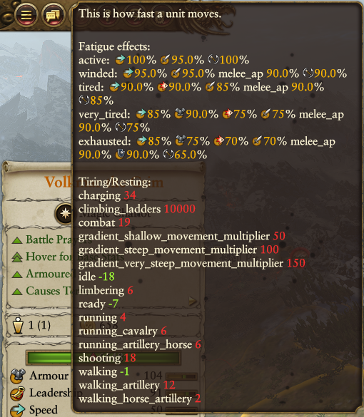
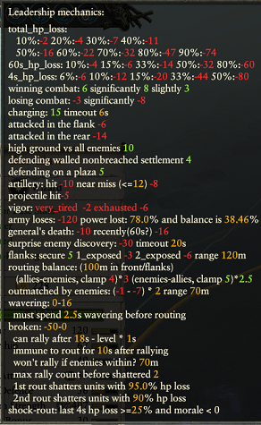
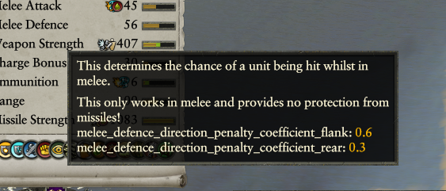
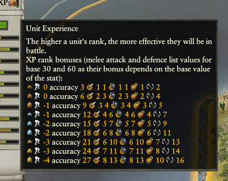

#### Spells

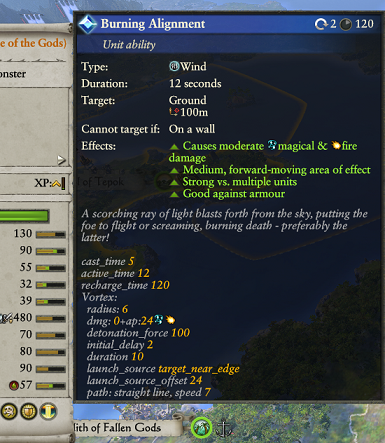
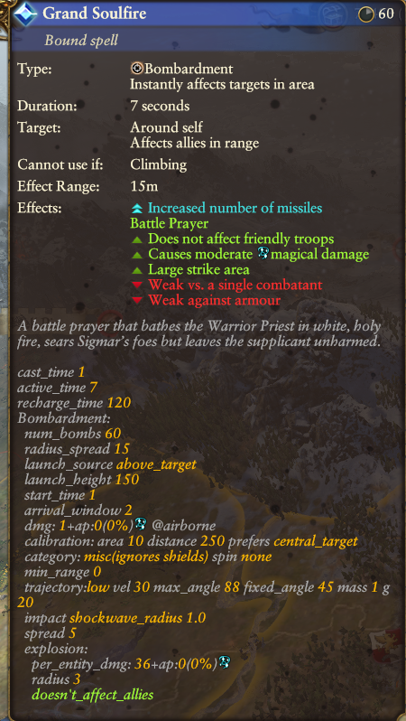
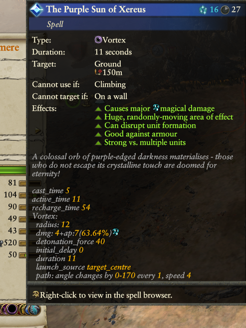
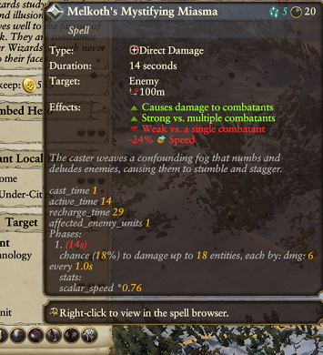


#### Unit stats

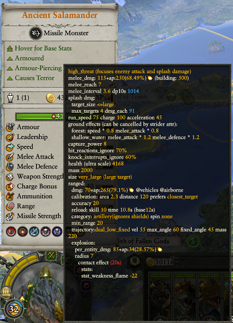
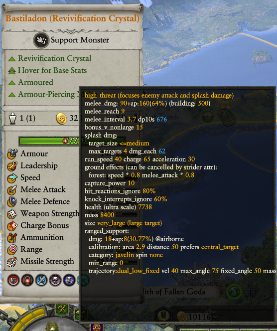
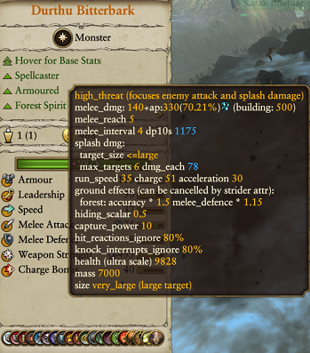
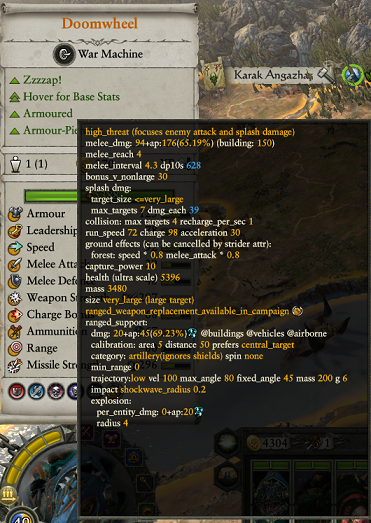

#### Unit campaign mods

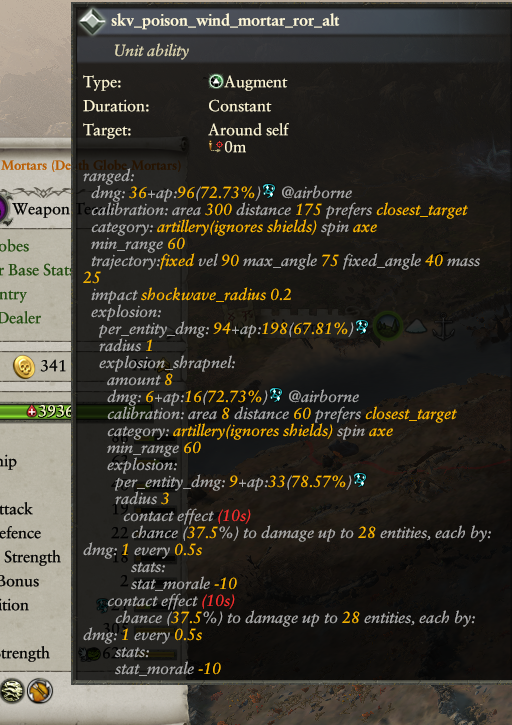
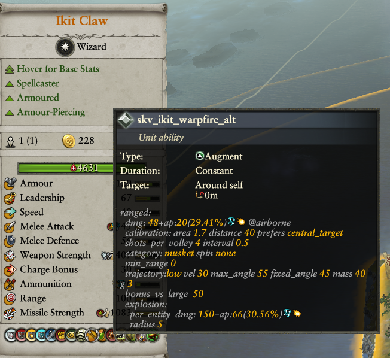
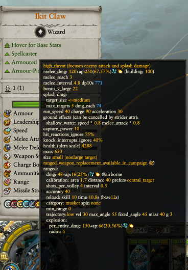
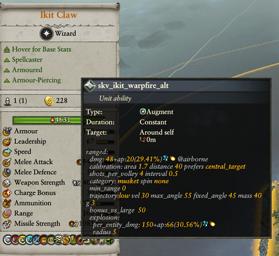

## Total War Rome 2

### Features

- The dynamic stat view has been sorted to have the same order for all units and extended to show more stats at the same time where possible
- Unit's otherwise inaccessible base stats are visible in the description window of the unit tab (it's a bit cramped, that's in order to make things fit in the quick battle screen):
    - missile block chance
    - campaign range
    - effects of dismounting a cavalry unit
    - stat debuffs for projectiles
    - stat changes between different types of arrows
    - many more
- Abilities have their tooltips augmented to show the exact stat effects on the units

### Screenshots

#### Unit base stats

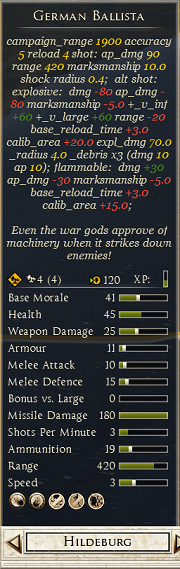
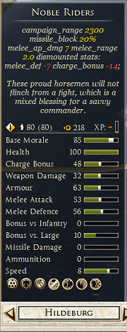
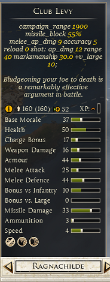
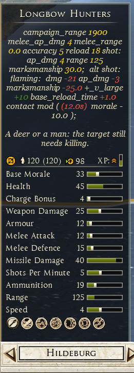
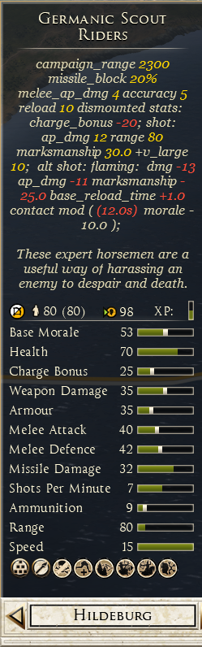

#### Ability tooltips

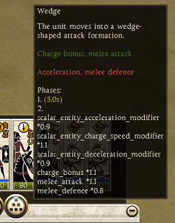
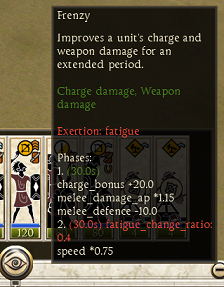

## Total War Atilla

### Features

- The dynamic stat view has been sorted to have the same order for all units and extended to show more stats at the same time
    - this includes the immensely useful missile_block_chance for shielded units and ammo, range, rate of fire for all ranged units
    - "rate of fire" dynamic stat is bugged when a unit has a modified weapon, this is bugged in the base game's code and can't be fixed by a mod (it's just a visual bug though, unaffecting the real rate of fire units); you can see it in the base game too when the fast firing units get the "slow rate of fire" red bullet point
- Remove spurious entries in the unit bulletpoints section, so that geniuenly useful info is not hidden by something which you can see in the dynamic stats
- Hover over the unit name on the unit card to get a more detailed view of the unit's base stats:
    - campaign range
    - effects of dismounting a cavalry unit
    - projectile effects, like explosions
    - many more

### Screenshots

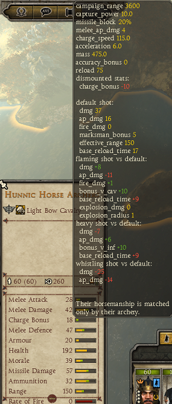
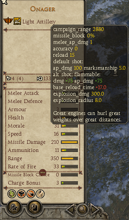
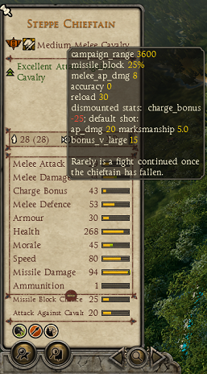

