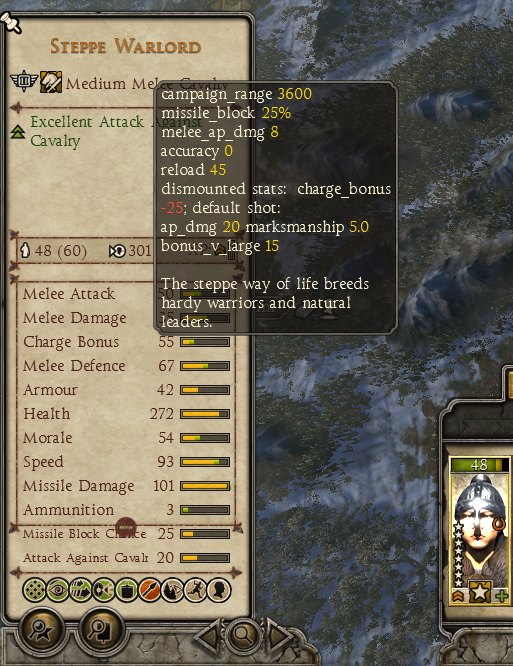
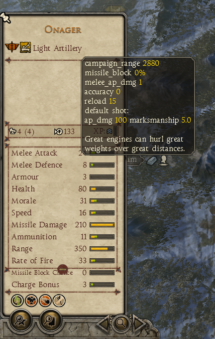
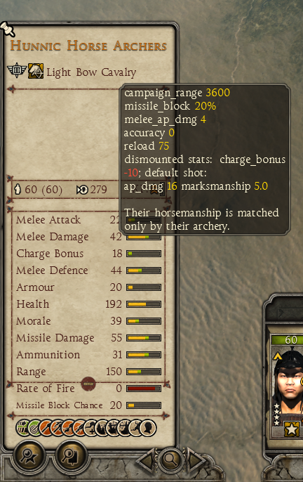

## Total war: Many more stats mod

### How to build and install the mod

1. Download and configure a release of [RPFM](https://github.com/Frodo45127/rpfm), release 2.4.3 was working fine at the time when this was written.
2. Install a python3 interpreter, the easiest way to do it is by using Microsoft Store, python 3.8.7 was working fine at the time when this was written.
3. Run the following in this repository (assuming you want to use the TW:atilla version of the mod)
```
# in command prompt run:
cd atilla
python generate.py "path/to/rpfm_cli.exe"
# for example python generate.py "C:/Program Files/RPFM/rpfm_cli.exe"
```
4. If the buid was successfull the mod should be installed to your RPFM my mods directory (Documents/TWMods)
5. To install open RPFM -> My mods -> atilla -> many_more_stats.pack, then select PackFile -> Install
6. To enable the mod in game:
   - run the game from steam launcher by selecting the modded tw game (if you change the game in the totalwar launcher mod manager will not be enabled)
   - open mod manager in the total war launcher
   - mark the many_more_stats.pack mod as active
   - click play

### Total War Atilla

#### Features

- The dynamic stat view has been sorted to have the same order for all units and extended to show more stats at the same time
    - this includes the immensely useful missile_block_chance for shielded units and ammo, range, rate of fire for all ranged units
    - "rate of fire" dynamic stat is bugged when a unit has a modified weapon, this is bugged in the base game's code and can't be fixed by a mod (it's just a visual bug though, unaffecting the real rate of fire units); you can see it in the base game too when the fast firing units get the "slow rate of fire" red bullet point
- Remove spurious entries in the unit bulletpoints section, so that geniuenly useful info is not hidden by something which you can see in the dynamic stats
- Hover over the unit name on the unit card to get a more detailed view of the unit's base stats:
    - campaign range
    - effects of dismounting a cavalry unit
    - damage bonuses

#### Screenshots





### Total War Warhammer 2

TBD

### Total War Rome 2

TBD